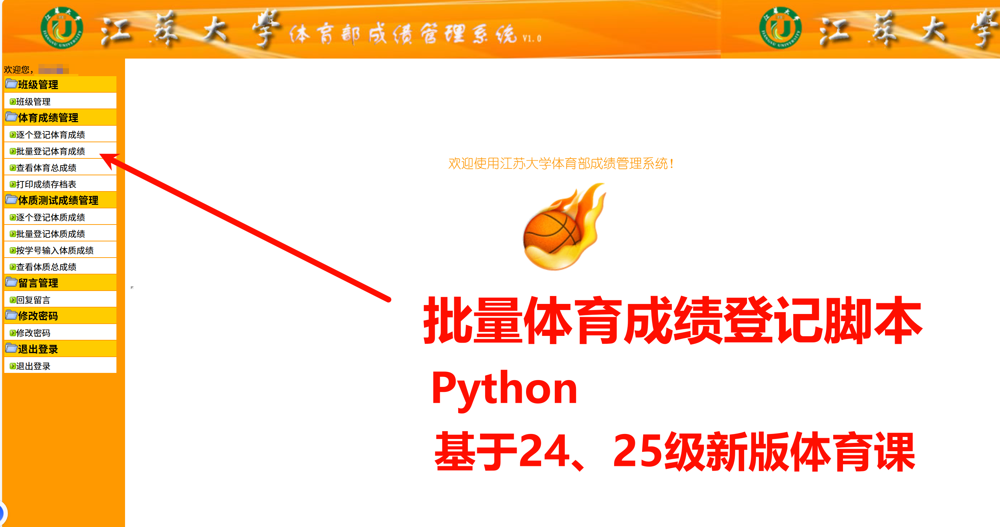
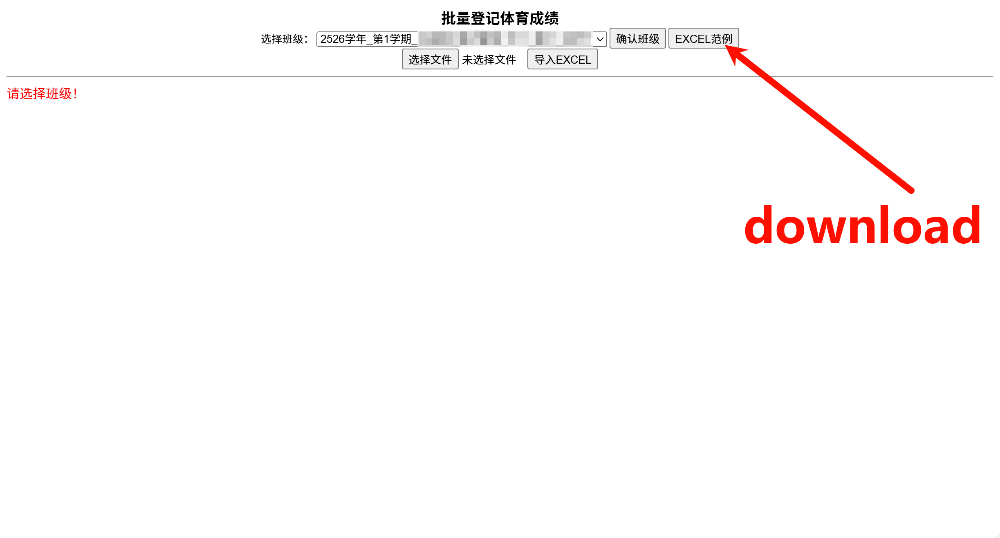
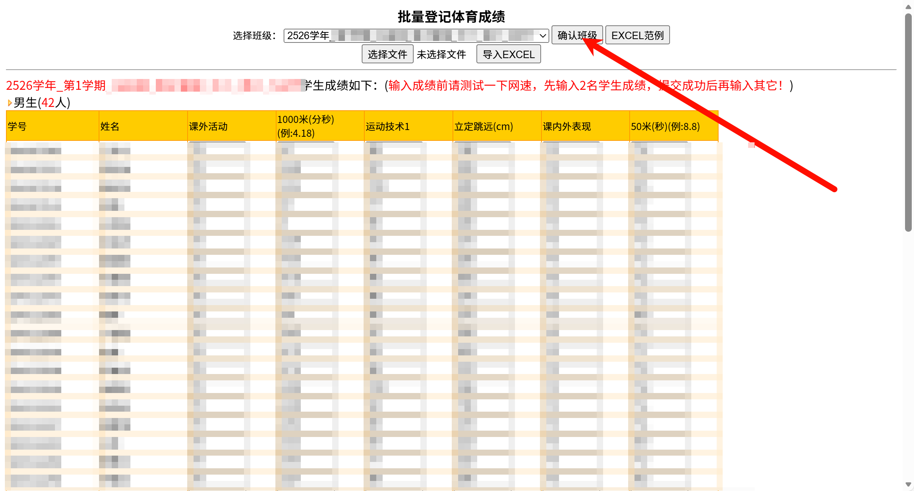
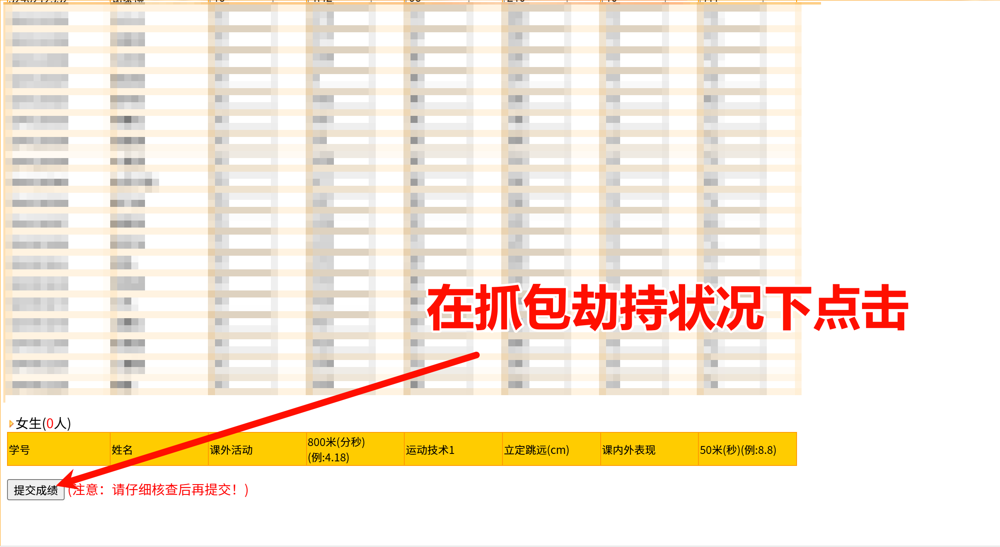
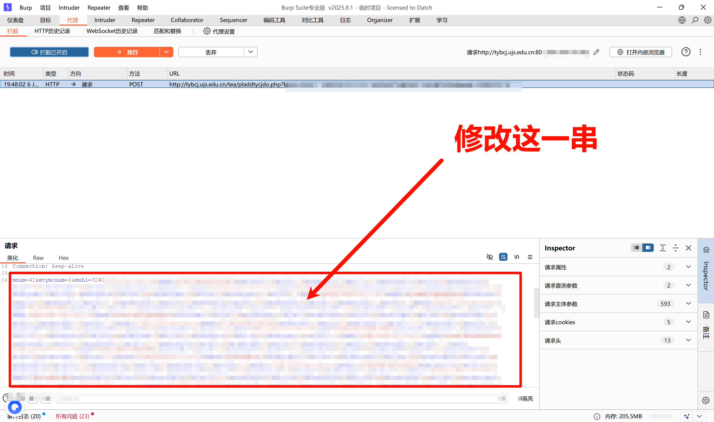
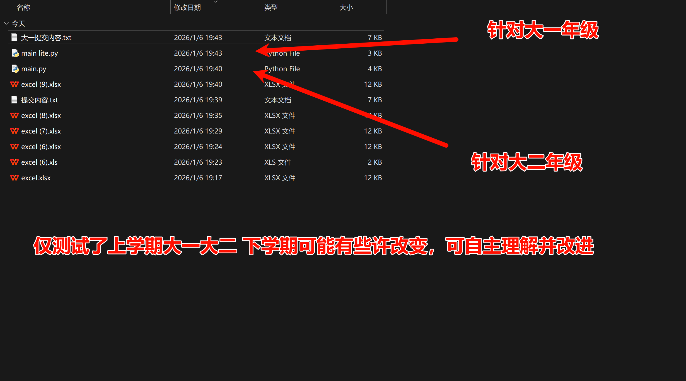

# JSU-PECourse-Assistant 🚀



针对江苏大学（UJS）体育部成绩上传（教师端）辅助工具（POST内容上传生成器)。


## ⚠️ 免责声明 (Disclaimer)

**在使用本项目之前，请务必阅读以下条款：**

1. **学术诚信**：本工具仅供学习交流和网络协议研究使用。请务必遵守学校相关规章制度，严禁利用本脚本进行恶意修改成绩、破坏系统公平性等行为。
2. **风险承担**：使用自动化脚本访问教务系统可能导致账号被封禁、被教务系统拉黑 IP 或触发学校相关处分。用户需自行承担使用本工具产生的一切后果。
3. **安全提醒**：**严禁**将包含个人账号、密码、服务器地址等敏感信息的配置文件直接上传至 GitHub 仓库！
4. **版权归属**：本项目不包含任何绕过验证码、破解数据库等非法功能。所有操作均模拟正常用户网络请求。

---

## 🌟 功能特点

- **批量处理**：支持通过 Excel 表格批量导入学生数据、课程代号等信息。
- **上传更加便捷**：体育部成绩管理系统由于年代久远，批量上传入口excel存在BUG，无法正常识别。但修改POST请求后使用，上传更便捷，本脚本即为post内容生成脚本。
- **协议模拟**：基于 `requests` 库高度模拟浏览器真实 POST 请求。
- **格式校验**：自动处理学号填充（20位补位）、GBK 编码转换等系统特殊要求。
- **安全透明**：脚本逻辑简单明了，不包含任何后门程序。

## 🛠️ 环境要求

- Python 3.8 或更高版本

- 必要的第三方库：

  ```bash
  pip install pandas requests openpyxl
  ```







## 🚀 快速上手

### 1. 配置数据

将待处理的数据填入 Excel 表格（参考仓库中的 `template.xlsx`)。

- **Sheet 名称**：对应班级或节次（如 `周二9-11节`）。
- **单元格 B1**：填入系统生成的 `bjdh`（班级代号）。

### 2. 运行脚本

在终端中执行：

```bash
python run_assistant.py
```

### 3. 提交成绩/选课

运行成功后，脚本会生成一个 `post提交内容.txt`：

1. 打开抓包工具（如 Fiddler 或 Charles）。

   

2. 在教务系统中触发一次手动提交。

3. 将 `提交内容.txt` 中的长字符串替换掉原始请求中的 `Body` 部分并重新发送。

## 文件夹结构

- `main.py`: 主运行脚本。
- template.xlsx: 存放数据的 Excel（示例）。
- `output/`: 默认的结果输出目录。

## 🤝 贡献与反馈

如果你发现了系统的新特性或 Bug，欢迎提交 Issue 或 Pull Request。

## 📄 开源协议

本项目采用 [MIT License](LICENSE) 开源。

